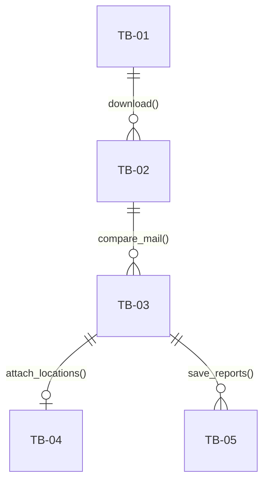
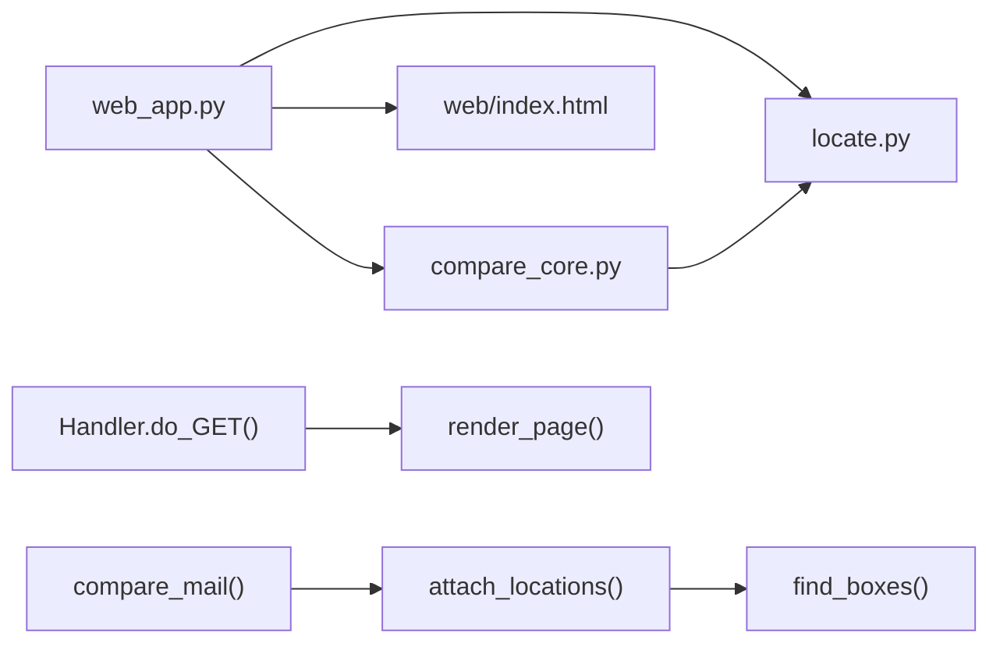
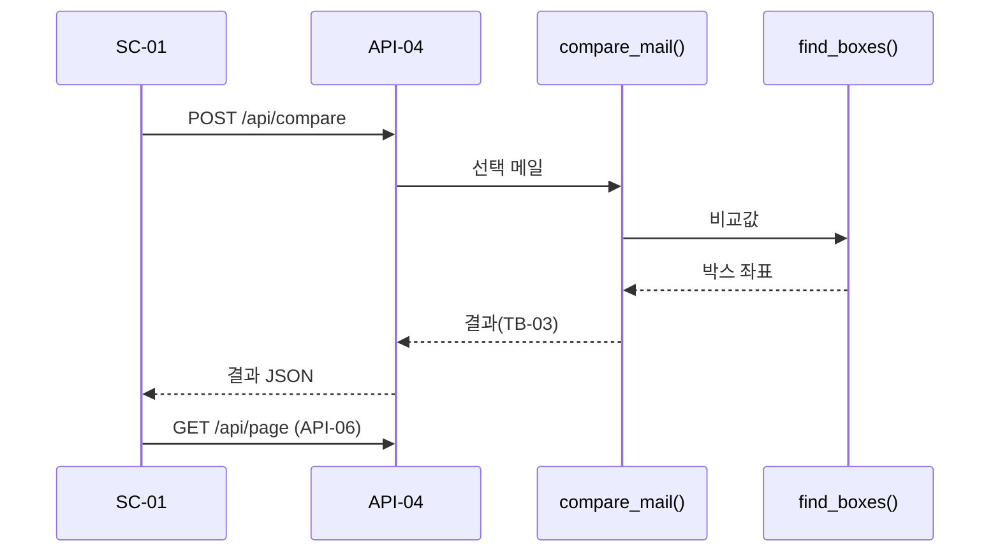

# 다이어그램

노드 이름이 ID·테이블·함수명과 같으면 HTML에서 클릭해 정의 위치로 이동한다.

## ERD (데이터 관계)

```mermaid
erDiagram
    TB-01 ||--o{ TB-02 : "download()"
    TB-02 ||--o{ TB-03 : "compare_mail()"
    TB-03 ||--o| TB-04 : "attach_locations()"
    TB-03 ||--o{ TB-05 : "save_reports()"
```

## 모듈 의존 (클래스/함수)

```mermaid
flowchart LR
    web_app["web_app.py"] --> compare_core["compare_core.py"]
    web_app --> locate["locate.py"]
    compare_core --> locate
    web_app --> index["web/index.html"]
    compare_core_compare["compare_mail()"] --> attach["attach_locations()"]
    attach --> find["find_boxes()"]
    web_app_page["Handler.do_GET()"] --> render["render_page()"]
```

## 시퀀스: 로컬 비교와 위치 표시

```mermaid
sequenceDiagram
    participant 화면 as SC-01
    participant 서버 as API-04
    participant 엔진 as compare_mail()
    participant 위치 as find_boxes()
    화면->>서버: POST /api/compare
    서버->>엔진: 선택 메일
    엔진->>위치: 비교값
    위치-->>엔진: 박스 좌표
    엔진-->>서버: 결과(TB-03)
    서버-->>화면: 결과 JSON
    화면->>서버: GET /api/page (API-06)
```
